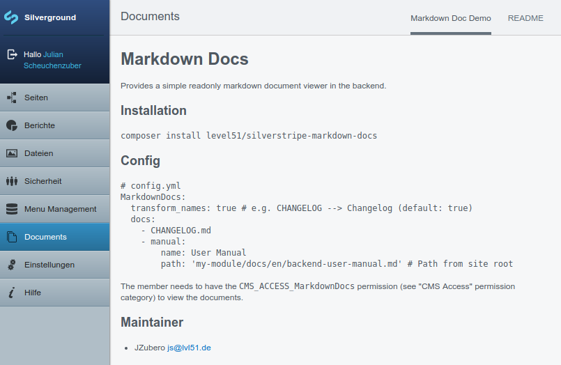

# Markdown Docs
Provides a simple readonly markdown document viewer in the backend.



## Features
- Renders markdown documents with the power of [Parsedown](http://parsedown.org/)
- Permission system integration to control who can view the documents
- Config API integration

## Installation

`composer install level51/silverstripe-markdown-docs`

## Config

```yaml
# config.yml
Level51\MarkdownDocs\MarkdownDocs:
  transform_names: true # e.g. CHANGELOG --> Changelog (default: true)
  docs:
    - CHANGELOG.md
    - manual:
        name: User Manual
        path: 'my-module/docs/en/backend-user-manual.md' # Path from site root
```

The member needs to have the `CMS_ACCESS_MarkdownDocs` permission (see "CMS Access" permission category) to view the documents.

## Maintainer
- JZubero <js@lvl51.de>
